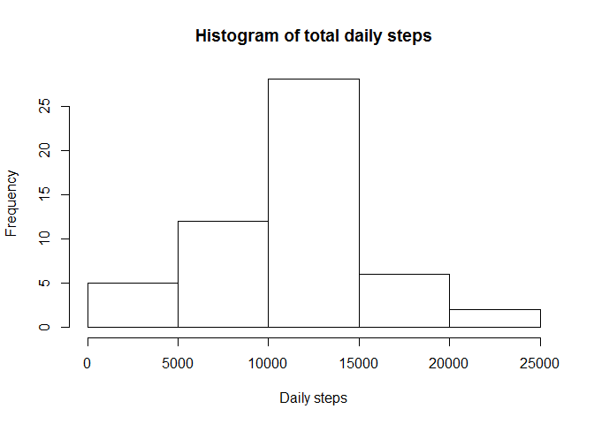
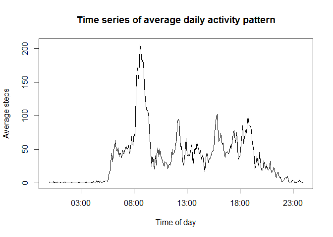
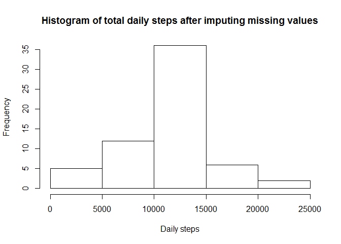
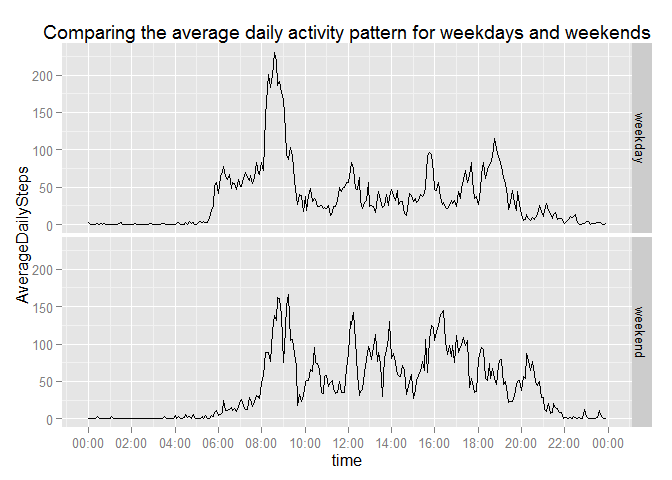

# Reproducible Research: Peer Assessment 1


## Loading and preprocessing the data

This part of the program unzips the zipped csv file, and then read it into an R dataframe called activityData. 
It then proceeds to create a proper combined date and time variable called datetime in the dataframe. 
Unneccesary variables (date and interval) are then removed from the dataframe.


```r
# set the working directory
setwd("C:/Users/Stefan/Desktop/RepData_PeerAssessment1")
# unzip and read the csv file
unzip("activity.zip")
activityData = read.csv("activity.csv", header = TRUE, sep =",")
# add zeros where necessary in front of the interval time variable
activityData$interval = sprintf("%04d", activityData$interval)
# covert date from factor to date class
activityData$date = as.Date(activityData$date, format = "%Y-%m-%d")
# create a combined variable of the date and time
activityData$datetime <- as.POSIXct(paste(activityData$date, activityData$interval), format="%Y-%m-%d %H%M")
# clean up unnecessary variables
activityData$date = NULL
activityData$interval = NULL
```

The first 10 rows of the final dataframe looks as follows:

```r
head(activityData, 10)
```

```
##    steps            datetime
## 1     NA 2012-10-01 00:00:00
## 2     NA 2012-10-01 00:05:00
## 3     NA 2012-10-01 00:10:00
## 4     NA 2012-10-01 00:15:00
## 5     NA 2012-10-01 00:20:00
## 6     NA 2012-10-01 00:25:00
## 7     NA 2012-10-01 00:30:00
## 8     NA 2012-10-01 00:35:00
## 9     NA 2012-10-01 00:40:00
## 10    NA 2012-10-01 00:45:00
```

## What is mean total number of steps taken per day?

A histogram of the total number of steps taken each day looks as follows (missing values are ignored (ignored meaning omitted)):


```r
# Reduce sensitivty for engineering notation output
options(scipen=5)
# Omit all the NAs from the dataframe as per the question
activityDataNoNA = na.omit(activityData)
# Sum up the number of steps per day
histogramData = aggregate(activityDataNoNA$steps, by=list((substr(activityDataNoNA$datetime,1,10))),sum)
colnames(histogramData) = c("date", "dailySteps")
# Calculate the mean of the steps per day
meanDailySteps = mean(histogramData$dailySteps)
medianDailySteps = median(histogramData$dailySteps)
# Create Histogram of the steps per day
hist(histogramData$dailySteps, main = "Histogram of total daily steps", xlab = "Daily steps")
```

 

**The mean of the daily steps in the above histogram is 10766 and the median is 10765. Remember this is based on a dataset where all NAs were removed.**

## What is the average daily activity pattern?

A time series plot of the average daily step activity pattern across all dates looks as follows:


```r
# Calculate the average number of steps for each time interval over all the days that has data
averageDailyData = aggregate(activityDataNoNA$steps, by=list((substr(activityDataNoNA$datetime,12,16))),mean)
colnames(averageDailyData) = c("time", "averageDailySteps")
# Create a proper time variable out of the time character variable
averageDailyData$time=strptime(averageDailyData$time, "%H:%M")
# Calculate the 5 minute interval with the maximum average number of steps
maxActivityInterval = as.character(averageDailyData$time[which.max(averageDailyData$averageDailySteps)])
maxActivityInterval = substr(maxActivityInterval, 12, 16)
# Create the plot
plot(averageDailyData$time,averageDailyData$averageDailySteps, type = "l", main = "Time series of average daily activity pattern", xlab = "Time of day", ylab = "Average steps")
```

 

**The 5 minute interval that contains the maximum number of steps on average across all the days in the dataset is 08:35.**

## Imputing missing values


```r
# Calculate the total number of NAs in the dataset and the size of the total dataset
sumNAs = sum(is.na(activityData$steps))
totalData = nrow(activityData)
```

**The total number of missing values (NAs) in the dataset is 2304 (out of a total number of 17568).**

To fill in missing values we will use the average of that time interval across all the days to replace the NA of a specific time interval on a specific day:


```r
# Create two character interval variables (one for the original dataset with NAs and one for average daily activity dataset) of the time of day interval
averageDailyData$interval = substr(as.character(averageDailyData$time),12,16)
activityData$interval = substr(as.character(activityData$datetime),12,16)
# Create a new dataset as was asked by the question and search for NAs in the original dataset, 
# and replace with the average value for the same interval value in the average daily activity dataset
activityDataNew = merge(activityData, averageDailyData, "interval")
activityDataNew$steps = ifelse(is.na(activityDataNew$steps), as.integer(round(activityDataNew$averageDailySteps, 0)), activityDataNew$steps)
activityDataNew = activityDataNew[with(activityDataNew, order(datetime, interval)),]
activityDataNew$time = NULL
activityDataNew$averageDailySteps = NULL
```

A histogram of the total number of steps taken each day looks as follows (with missing values now imputed from the average of that time interval across all the days to replace the NA of a specific time interval on a specific day)):


```r
# Reduce sensitivty for engineering notation output
options(scipen=5)
# Sum up the number of steps per day
histogramDataNew = aggregate(activityDataNew$steps, by=list((substr(activityDataNew$datetime,1,10))),sum)
colnames(histogramDataNew) = c("date", "dailySteps")
# Calculate the mean of the steps per day
meanDailyStepsNew = mean(histogramDataNew$dailySteps)
medianDailyStepsNew = median(histogramDataNew$dailySteps)
# Create Histogram of the steps per day
hist(histogramDataNew$dailySteps, main = "Histogram of total daily steps after imputing missing values", xlab = "Daily steps")
```

 


**The mean of the daily steps in the above histogram where missings were impured is 10766 (the mean when NAs were removed was 10766) and the median where missings were imputed is 10762 (the median when NAs were removed was 10765). The impact of imputing missing values based on my assumption for imputing therefore did not have much of an effect on the mean and median.**

## Are there differences in activity patterns between weekdays and weekends?

First we need to add the weekend/weekday variable to our dataset:


```r
# Add a variable with the name of the day
activityDataNew$weekdays = weekdays(activityDataNew$datetime)
# Use this variable to create a factor variable of weekend/weekday
activityDataNew$weekdaysFactor = ifelse(activityDataNew$weekdays == "Saturday" | activityDataNew$weekdays == "Sunday", "weekend", "weekday")
activityDataNew$weekdaysFactor = as.factor(activityDataNew$weekdaysFactor)
```

The following plot shows the time series plot of the average daily step activity pattern across all dates, split by weekend and weekday:


```r
library(ggplot2)
library(scales)
# Calculate the average number of steps for each time interval over all the days that has data
averageDailyDataNew = aggregate(activityDataNew$steps, by=list((substr(activityDataNew$datetime,12,16)),activityDataNew$weekdaysFactor),mean)
colnames(averageDailyDataNew) = c("time","typeofday", "AverageDailySteps")
# Create a proper time variable out of the time character variable
averageDailyDataNew$time=strptime(averageDailyDataNew$time, "%H:%M")
averageDailyDataNew$time = as.POSIXct(averageDailyDataNew$time)
p = ggplot(averageDailyDataNew, aes(x=time, y=AverageDailySteps)) + geom_line()+ scale_x_datetime(breaks=date_breaks('2 hour'), labels = function(x) format(x, "%H:%M", tz="Africa/Johannesburg")) + ggtitle("Comparing the average daily activity pattern for weekdays and weekends")
p + facet_grid(typeofday~.)
```

 

As expected, the weekend shows overall slighly less activity early in the morning, slightly more activity during the day, and more activity later in the evening.
